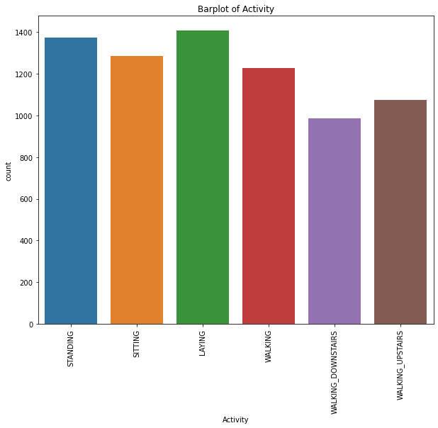
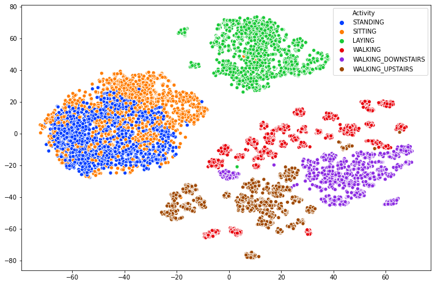
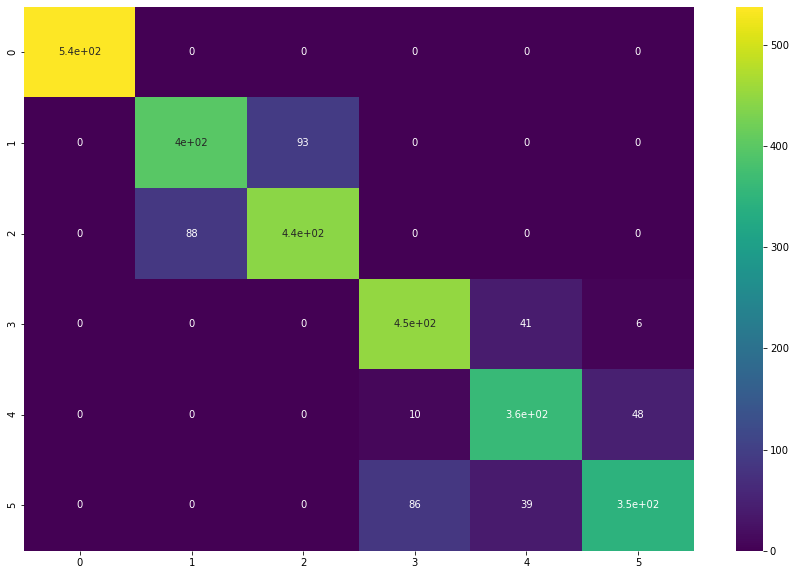

### Train Data 
<table border="1" class="dataframe">
  <thead>
    <tr style="text-align: right;">
      <th></th>
      <th>tBodyAcc-mean()-X</th>
      <th>tBodyAcc-mean()-Y</th>
      <th>tBodyAcc-mean()-Z</th>
      <th>tBodyAcc-std()-X</th>
      <th>tBodyAcc-std()-Y</th>
      <th>tBodyAcc-std()-Z</th>
      <th>tBodyAcc-mad()-X</th>
      <th>tBodyAcc-mad()-Y</th>
      <th>tBodyAcc-mad()-Z</th>
      <th>tBodyAcc-max()-X</th>
      <th>...</th>
      <th>fBodyBodyGyroJerkMag-kurtosis()</th>
      <th>angle(tBodyAccMean,gravity)</th>
      <th>angle(tBodyAccJerkMean),gravityMean)</th>
      <th>angle(tBodyGyroMean,gravityMean)</th>
      <th>angle(tBodyGyroJerkMean,gravityMean)</th>
      <th>angle(X,gravityMean)</th>
      <th>angle(Y,gravityMean)</th>
      <th>angle(Z,gravityMean)</th>
      <th>subject</th>
      <th>Activity</th>
    </tr>
  </thead>
  <tbody>
    <tr>
      <th>0</th>
      <td>0.288585</td>
      <td>-0.020294</td>
      <td>-0.132905</td>
      <td>-0.995279</td>
      <td>-0.983111</td>
      <td>-0.913526</td>
      <td>-0.995112</td>
      <td>-0.983185</td>
      <td>-0.923527</td>
      <td>-0.934724</td>
      <td>...</td>
      <td>-0.710304</td>
      <td>-0.112754</td>
      <td>0.030400</td>
      <td>-0.464761</td>
      <td>-0.018446</td>
      <td>-0.841247</td>
      <td>0.179941</td>
      <td>-0.058627</td>
      <td>1</td>
      <td>STANDING</td>
    </tr>
    <tr>
      <th>1</th>
      <td>0.278419</td>
      <td>-0.016411</td>
      <td>-0.123520</td>
      <td>-0.998245</td>
      <td>-0.975300</td>
      <td>-0.960322</td>
      <td>-0.998807</td>
      <td>-0.974914</td>
      <td>-0.957686</td>
      <td>-0.943068</td>
      <td>...</td>
      <td>-0.861499</td>
      <td>0.053477</td>
      <td>-0.007435</td>
      <td>-0.732626</td>
      <td>0.703511</td>
      <td>-0.844788</td>
      <td>0.180289</td>
      <td>-0.054317</td>
      <td>1</td>
      <td>STANDING</td>
    </tr>
    <tr>
      <th>2</th>
      <td>0.279653</td>
      <td>-0.019467</td>
      <td>-0.113462</td>
      <td>-0.995380</td>
      <td>-0.967187</td>
      <td>-0.978944</td>
      <td>-0.996520</td>
      <td>-0.963668</td>
      <td>-0.977469</td>
      <td>-0.938692</td>
      <td>...</td>
      <td>-0.760104</td>
      <td>-0.118559</td>
      <td>0.177899</td>
      <td>0.100699</td>
      <td>0.808529</td>
      <td>-0.848933</td>
      <td>0.180637</td>
      <td>-0.049118</td>
      <td>1</td>
      <td>STANDING</td>
    </tr>
    <tr>
      <th>3</th>
      <td>0.279174</td>
      <td>-0.026201</td>
      <td>-0.123283</td>
      <td>-0.996091</td>
      <td>-0.983403</td>
      <td>-0.990675</td>
      <td>-0.997099</td>
      <td>-0.982750</td>
      <td>-0.989302</td>
      <td>-0.938692</td>
      <td>...</td>
      <td>-0.482845</td>
      <td>-0.036788</td>
      <td>-0.012892</td>
      <td>0.640011</td>
      <td>-0.485366</td>
      <td>-0.848649</td>
      <td>0.181935</td>
      <td>-0.047663</td>
      <td>1</td>
      <td>STANDING</td>
    </tr>
    <tr>
      <th>4</th>
      <td>0.276629</td>
      <td>-0.016570</td>
      <td>-0.115362</td>
      <td>-0.998139</td>
      <td>-0.980817</td>
      <td>-0.990482</td>
      <td>-0.998321</td>
      <td>-0.979672</td>
      <td>-0.990441</td>
      <td>-0.942469</td>
      <td>...</td>
      <td>-0.699205</td>
      <td>0.123320</td>
      <td>0.122542</td>
      <td>0.693578</td>
      <td>-0.615971</td>
      <td>-0.847865</td>
      <td>0.185151</td>
      <td>-0.043892</td>
      <td>1</td>
      <td>STANDING</td>
    </tr>
  </tbody>
</table>

5 rows × 563 columns

### Test Data

<table border="1" class="dataframe">
  <thead>
    <tr style="text-align: right;">
      <th></th>
      <th>tBodyAcc-mean()-X</th>
      <th>tBodyAcc-mean()-Y</th>
      <th>tBodyAcc-mean()-Z</th>
      <th>tBodyAcc-std()-X</th>
      <th>tBodyAcc-std()-Y</th>
      <th>tBodyAcc-std()-Z</th>
      <th>tBodyAcc-mad()-X</th>
      <th>tBodyAcc-mad()-Y</th>
      <th>tBodyAcc-mad()-Z</th>
      <th>tBodyAcc-max()-X</th>
      <th>...</th>
      <th>fBodyBodyGyroJerkMag-kurtosis()</th>
      <th>angle(tBodyAccMean,gravity)</th>
      <th>angle(tBodyAccJerkMean),gravityMean)</th>
      <th>angle(tBodyGyroMean,gravityMean)</th>
      <th>angle(tBodyGyroJerkMean,gravityMean)</th>
      <th>angle(X,gravityMean)</th>
      <th>angle(Y,gravityMean)</th>
      <th>angle(Z,gravityMean)</th>
      <th>subject</th>
      <th>Activity</th>
    </tr>
  </thead>
  <tbody>
    <tr>
      <th>0</th>
      <td>0.257178</td>
      <td>-0.023285</td>
      <td>-0.014654</td>
      <td>-0.938404</td>
      <td>-0.920091</td>
      <td>-0.667683</td>
      <td>-0.952501</td>
      <td>-0.925249</td>
      <td>-0.674302</td>
      <td>-0.894088</td>
      <td>...</td>
      <td>-0.705974</td>
      <td>0.006462</td>
      <td>0.162920</td>
      <td>-0.825886</td>
      <td>0.271151</td>
      <td>-0.720009</td>
      <td>0.276801</td>
      <td>-0.057978</td>
      <td>2</td>
      <td>STANDING</td>
    </tr>
    <tr>
      <th>1</th>
      <td>0.286027</td>
      <td>-0.013163</td>
      <td>-0.119083</td>
      <td>-0.975415</td>
      <td>-0.967458</td>
      <td>-0.944958</td>
      <td>-0.986799</td>
      <td>-0.968401</td>
      <td>-0.945823</td>
      <td>-0.894088</td>
      <td>...</td>
      <td>-0.594944</td>
      <td>-0.083495</td>
      <td>0.017500</td>
      <td>-0.434375</td>
      <td>0.920593</td>
      <td>-0.698091</td>
      <td>0.281343</td>
      <td>-0.083898</td>
      <td>2</td>
      <td>STANDING</td>
    </tr>
    <tr>
      <th>2</th>
      <td>0.275485</td>
      <td>-0.026050</td>
      <td>-0.118152</td>
      <td>-0.993819</td>
      <td>-0.969926</td>
      <td>-0.962748</td>
      <td>-0.994403</td>
      <td>-0.970735</td>
      <td>-0.963483</td>
      <td>-0.939260</td>
      <td>...</td>
      <td>-0.640736</td>
      <td>-0.034956</td>
      <td>0.202302</td>
      <td>0.064103</td>
      <td>0.145068</td>
      <td>-0.702771</td>
      <td>0.280083</td>
      <td>-0.079346</td>
      <td>2</td>
      <td>STANDING</td>
    </tr>
    <tr>
      <th>3</th>
      <td>0.270298</td>
      <td>-0.032614</td>
      <td>-0.117520</td>
      <td>-0.994743</td>
      <td>-0.973268</td>
      <td>-0.967091</td>
      <td>-0.995274</td>
      <td>-0.974471</td>
      <td>-0.968897</td>
      <td>-0.938610</td>
      <td>...</td>
      <td>-0.736124</td>
      <td>-0.017067</td>
      <td>0.154438</td>
      <td>0.340134</td>
      <td>0.296407</td>
      <td>-0.698954</td>
      <td>0.284114</td>
      <td>-0.077108</td>
      <td>2</td>
      <td>STANDING</td>
    </tr>
    <tr>
      <th>4</th>
      <td>0.274833</td>
      <td>-0.027848</td>
      <td>-0.129527</td>
      <td>-0.993852</td>
      <td>-0.967445</td>
      <td>-0.978295</td>
      <td>-0.994111</td>
      <td>-0.965953</td>
      <td>-0.977346</td>
      <td>-0.938610</td>
      <td>...</td>
      <td>-0.846595</td>
      <td>-0.002223</td>
      <td>-0.040046</td>
      <td>0.736715</td>
      <td>-0.118545</td>
      <td>-0.692245</td>
      <td>0.290722</td>
      <td>-0.073857</td>
      <td>2</td>
      <td>STANDING</td>
    </tr>
  </tbody>
</table>

5 rows × 563 columns

### Train Data Vizualization 

#### Trainning Classes

#### How Training data are speread into data set

<table border="1" class="dataframe">
  <thead>
    <tr style="text-align: right;">
      <th></th>
      <th>tBodyAcc-mean()-X</th>
      <th>tBodyAcc-mean()-Y</th>
      <th>tBodyAcc-mean()-Z</th>
      <th>tBodyAcc-std()-X</th>
      <th>tBodyAcc-std()-Y</th>
      <th>tBodyAcc-std()-Z</th>
      <th>tBodyAcc-mad()-X</th>
      <th>tBodyAcc-mad()-Y</th>
      <th>tBodyAcc-mad()-Z</th>
      <th>tBodyAcc-max()-X</th>
      <th>...</th>
      <th>fBodyBodyGyroJerkMag-skewness()</th>
      <th>fBodyBodyGyroJerkMag-kurtosis()</th>
      <th>angle(tBodyAccMean,gravity)</th>
      <th>angle(tBodyAccJerkMean),gravityMean)</th>
      <th>angle(tBodyGyroMean,gravityMean)</th>
      <th>angle(tBodyGyroJerkMean,gravityMean)</th>
      <th>angle(X,gravityMean)</th>
      <th>angle(Y,gravityMean)</th>
      <th>angle(Z,gravityMean)</th>
      <th>subject</th>
    </tr>
  </thead>
  <tbody>
    <tr>
      <th>count</th>
      <td>7352.000000</td>
      <td>7352.000000</td>
      <td>7352.000000</td>
      <td>7352.000000</td>
      <td>7352.000000</td>
      <td>7352.000000</td>
      <td>7352.000000</td>
      <td>7352.000000</td>
      <td>7352.000000</td>
      <td>7352.000000</td>
      <td>...</td>
      <td>7352.000000</td>
      <td>7352.000000</td>
      <td>7352.000000</td>
      <td>7352.000000</td>
      <td>7352.000000</td>
      <td>7352.000000</td>
      <td>7352.000000</td>
      <td>7352.000000</td>
      <td>7352.000000</td>
      <td>7352.000000</td>
    </tr>
    <tr>
      <th>mean</th>
      <td>0.274488</td>
      <td>-0.017695</td>
      <td>-0.109141</td>
      <td>-0.605438</td>
      <td>-0.510938</td>
      <td>-0.604754</td>
      <td>-0.630512</td>
      <td>-0.526907</td>
      <td>-0.606150</td>
      <td>-0.468604</td>
      <td>...</td>
      <td>-0.307009</td>
      <td>-0.625294</td>
      <td>0.008684</td>
      <td>0.002186</td>
      <td>0.008726</td>
      <td>-0.005981</td>
      <td>-0.489547</td>
      <td>0.058593</td>
      <td>-0.056515</td>
      <td>17.413085</td>
    </tr>
    <tr>
      <th>std</th>
      <td>0.070261</td>
      <td>0.040811</td>
      <td>0.056635</td>
      <td>0.448734</td>
      <td>0.502645</td>
      <td>0.418687</td>
      <td>0.424073</td>
      <td>0.485942</td>
      <td>0.414122</td>
      <td>0.544547</td>
      <td>...</td>
      <td>0.321011</td>
      <td>0.307584</td>
      <td>0.336787</td>
      <td>0.448306</td>
      <td>0.608303</td>
      <td>0.477975</td>
      <td>0.511807</td>
      <td>0.297480</td>
      <td>0.279122</td>
      <td>8.975143</td>
    </tr>
    <tr>
      <th>min</th>
      <td>-1.000000</td>
      <td>-1.000000</td>
      <td>-1.000000</td>
      <td>-1.000000</td>
      <td>-0.999873</td>
      <td>-1.000000</td>
      <td>-1.000000</td>
      <td>-1.000000</td>
      <td>-1.000000</td>
      <td>-1.000000</td>
      <td>...</td>
      <td>-0.995357</td>
      <td>-0.999765</td>
      <td>-0.976580</td>
      <td>-1.000000</td>
      <td>-1.000000</td>
      <td>-1.000000</td>
      <td>-1.000000</td>
      <td>-1.000000</td>
      <td>-1.000000</td>
      <td>1.000000</td>
    </tr>
    <tr>
      <th>25%</th>
      <td>0.262975</td>
      <td>-0.024863</td>
      <td>-0.120993</td>
      <td>-0.992754</td>
      <td>-0.978129</td>
      <td>-0.980233</td>
      <td>-0.993591</td>
      <td>-0.978162</td>
      <td>-0.980251</td>
      <td>-0.936219</td>
      <td>...</td>
      <td>-0.542602</td>
      <td>-0.845573</td>
      <td>-0.121527</td>
      <td>-0.289549</td>
      <td>-0.482273</td>
      <td>-0.376341</td>
      <td>-0.812065</td>
      <td>-0.017885</td>
      <td>-0.143414</td>
      <td>8.000000</td>
    </tr>
    <tr>
      <th>50%</th>
      <td>0.277193</td>
      <td>-0.017219</td>
      <td>-0.108676</td>
      <td>-0.946196</td>
      <td>-0.851897</td>
      <td>-0.859365</td>
      <td>-0.950709</td>
      <td>-0.857328</td>
      <td>-0.857143</td>
      <td>-0.881637</td>
      <td>...</td>
      <td>-0.343685</td>
      <td>-0.711692</td>
      <td>0.009509</td>
      <td>0.008943</td>
      <td>0.008735</td>
      <td>-0.000368</td>
      <td>-0.709417</td>
      <td>0.182071</td>
      <td>0.003181</td>
      <td>19.000000</td>
    </tr>
    <tr>
      <th>75%</th>
      <td>0.288461</td>
      <td>-0.010783</td>
      <td>-0.097794</td>
      <td>-0.242813</td>
      <td>-0.034231</td>
      <td>-0.262415</td>
      <td>-0.292680</td>
      <td>-0.066701</td>
      <td>-0.265671</td>
      <td>-0.017129</td>
      <td>...</td>
      <td>-0.126979</td>
      <td>-0.503878</td>
      <td>0.150865</td>
      <td>0.292861</td>
      <td>0.506187</td>
      <td>0.359368</td>
      <td>-0.509079</td>
      <td>0.248353</td>
      <td>0.107659</td>
      <td>26.000000</td>
    </tr>
    <tr>
      <th>max</th>
      <td>1.000000</td>
      <td>1.000000</td>
      <td>1.000000</td>
      <td>1.000000</td>
      <td>0.916238</td>
      <td>1.000000</td>
      <td>1.000000</td>
      <td>0.967664</td>
      <td>1.000000</td>
      <td>1.000000</td>
      <td>...</td>
      <td>0.989538</td>
      <td>0.956845</td>
      <td>1.000000</td>
      <td>1.000000</td>
      <td>0.998702</td>
      <td>0.996078</td>
      <td>1.000000</td>
      <td>0.478157</td>
      <td>1.000000</td>
      <td>30.000000</td>
    </tr>
  </tbody>
</table>

8 rows × 562 columns

### Best Parameter for DecisionTreeClassifier Using RandomSearchCV

    RandomizedSearchCV(cv=None, error_score=nan,
                       estimator=DecisionTreeClassifier(ccp_alpha=0.0,
                                                        class_weight=None,
                                                        criterion='gini',
                                                        max_depth=None,
                                                        max_features=None,
                                                        max_leaf_nodes=None,
                                                        min_impurity_decrease=0.0,
                                                        min_impurity_split=None,
                                                        min_samples_leaf=1,
                                                        min_samples_split=2,
                                                        min_weight_fraction_leaf=0.0,
                                                        presort='deprecated',
                                                        random_state=None,
                                                        splitter='best'),
                       iid='deprecated', n_iter=10, n_jobs=None,
                       param_distributions={'criterion': ['gini', 'entropy'],
                                            'max_depth': [5, 6, 7, 8, 9, 10, 15],
                                            'min_samples_leaf': [2, 4, 6]},
                       pre_dispatch='2*n_jobs', random_state=42, refit=True,
                       return_train_score=False, scoring=None, verbose=0)

#### Decision Tree Confusion Matrix

#### Classification Report

                        precision    recall  f1-score   support
    
                LAYING       1.00      1.00      1.00       537
               SITTING       0.82      0.81      0.81       491
              STANDING       0.83      0.83      0.83       532
               WALKING       0.82      0.91      0.86       496
    WALKING_DOWNSTAIRS       0.82      0.86      0.84       420
      WALKING_UPSTAIRS       0.86      0.73      0.79       471
    
              accuracy                           0.86      2947
             macro avg       0.86      0.86      0.86      2947
          weighted avg       0.86      0.86      0.86      2947
    

 ### K - Nearest Neighbor

#### Hyperparameter Tuning using GridSearchCV

    GridSearchCV(cv=10, error_score=nan,
                 estimator=KNeighborsClassifier(algorithm='auto', leaf_size=30,
                                                metric='minkowski',
                                                metric_params=None, n_jobs=None,
                                                n_neighbors=5, p=2,
                                                weights='uniform'),
                 iid='deprecated', n_jobs=None,
                 param_grid={'leaf_size': [100, 200, 400],
                             'n_neighbors': [5, 10, 15, 20],
                             'weights': ['uniform', 'distance']},
                 pre_dispatch='2*n_jobs', refit=True, return_train_score=False,
                 scoring=None, verbose=0)

#### Parameters Cross validation Scores

    {'mean_fit_time': array([0.9833288 , 1.01018047, 0.97393866, 1.03180003, 1.00484285,
            1.0009861 , 0.95736079, 0.95537102, 0.86311636, 0.83865423,
            0.84260538, 0.81234019, 0.81643698, 0.82432711, 0.83826373,
            0.81385148, 0.69424596, 0.72932589, 0.69188905, 0.71505296,
            0.68060167, 0.73592076, 0.73995571, 0.75275621]),
     'std_fit_time': array([0.06628775, 0.06133024, 0.02741047, 0.03346197, 0.02662681,
            0.0371974 , 0.04174371, 0.03046969, 0.02637069, 0.04391606,
            0.02216211, 0.02602417, 0.02653173, 0.03268621, 0.02836933,
            0.01965087, 0.02920461, 0.05515497, 0.03741543, 0.01354451,
            0.03011129, 0.04008596, 0.02800346, 0.04655738]),
     'mean_score_time': array([1.06189265, 1.07332931, 1.10777717, 1.13303299, 1.21390772,
            1.17987356, 1.23332827, 1.17406003, 1.04527724, 1.01447372,
            1.08605642, 1.03799293, 1.08341451, 1.07243233, 1.13417971,
            1.11480918, 1.02674885, 1.005845  , 1.08556042, 1.03169703,
            1.08297384, 1.11800549, 1.16635559, 1.17006154]),
     'std_score_time': array([0.23956356, 0.26363011, 0.2598528 , 0.25333403, 0.27462399,
            0.26992445, 0.28593096, 0.2628897 , 0.24671801, 0.2257647 ,
            0.27324628, 0.21937784, 0.26188519, 0.25724271, 0.25782156,
            0.26369499, 0.27830301, 0.2187268 , 0.27953336, 0.25301241,
            0.24835224, 0.26079719, 0.29660296, 0.27657547]),
     'param_leaf_size': masked_array(data=[100, 100, 100, 100, 100, 100, 100, 100, 200, 200, 200,
                        200, 200, 200, 200, 200, 400, 400, 400, 400, 400, 400,
                        400, 400],
                  mask=[False, False, False, False, False, False, False, False,
                        False, False, False, False, False, False, False, False,
                        False, False, False, False, False, False, False, False],
            fill_value='?',
                 dtype=object),
     'param_n_neighbors': masked_array(data=[5, 5, 10, 10, 15, 15, 20, 20, 5, 5, 10, 10, 15, 15, 20,
                        20, 5, 5, 10, 10, 15, 15, 20, 20],
                  mask=[False, False, False, False, False, False, False, False,
                        False, False, False, False, False, False, False, False,
                        False, False, False, False, False, False, False, False],
            fill_value='?',
                 dtype=object),
     'param_weights': masked_array(data=['uniform', 'distance', 'uniform', 'distance',
                        'uniform', 'distance', 'uniform', 'distance',
                        'uniform', 'distance', 'uniform', 'distance',
                        'uniform', 'distance', 'uniform', 'distance',
                        'uniform', 'distance', 'uniform', 'distance',
                        'uniform', 'distance', 'uniform', 'distance'],
                  mask=[False, False, False, False, False, False, False, False,
                        False, False, False, False, False, False, False, False,
                        False, False, False, False, False, False, False, False],
            fill_value='?',
                 dtype=object),
     'params': [{'leaf_size': 100, 'n_neighbors': 5, 'weights': 'uniform'},
      {'leaf_size': 100, 'n_neighbors': 5, 'weights': 'distance'},
      {'leaf_size': 100, 'n_neighbors': 10, 'weights': 'uniform'},
      {'leaf_size': 100, 'n_neighbors': 10, 'weights': 'distance'},
      {'leaf_size': 100, 'n_neighbors': 15, 'weights': 'uniform'},
      {'leaf_size': 100, 'n_neighbors': 15, 'weights': 'distance'},
      {'leaf_size': 100, 'n_neighbors': 20, 'weights': 'uniform'},
      {'leaf_size': 100, 'n_neighbors': 20, 'weights': 'distance'},
      {'leaf_size': 200, 'n_neighbors': 5, 'weights': 'uniform'},
      {'leaf_size': 200, 'n_neighbors': 5, 'weights': 'distance'},
      {'leaf_size': 200, 'n_neighbors': 10, 'weights': 'uniform'},
      {'leaf_size': 200, 'n_neighbors': 10, 'weights': 'distance'},
      {'leaf_size': 200, 'n_neighbors': 15, 'weights': 'uniform'},
      {'leaf_size': 200, 'n_neighbors': 15, 'weights': 'distance'},
      {'leaf_size': 200, 'n_neighbors': 20, 'weights': 'uniform'},
      {'leaf_size': 200, 'n_neighbors': 20, 'weights': 'distance'},
      {'leaf_size': 400, 'n_neighbors': 5, 'weights': 'uniform'},
      {'leaf_size': 400, 'n_neighbors': 5, 'weights': 'distance'},
      {'leaf_size': 400, 'n_neighbors': 10, 'weights': 'uniform'},
      {'leaf_size': 400, 'n_neighbors': 10, 'weights': 'distance'},
      {'leaf_size': 400, 'n_neighbors': 15, 'weights': 'uniform'},
      {'leaf_size': 400, 'n_neighbors': 15, 'weights': 'distance'},
      {'leaf_size': 400, 'n_neighbors': 20, 'weights': 'uniform'},
      {'leaf_size': 400, 'n_neighbors': 20, 'weights': 'distance'}],
     'split0_test_score': array([0.74320652, 0.74048913, 0.72826087, 0.73777174, 0.72554348,
            0.72282609, 0.72418478, 0.72418478, 0.74320652, 0.74048913,
            0.72826087, 0.73777174, 0.72554348, 0.72282609, 0.72418478,
            0.72418478, 0.74320652, 0.74048913, 0.72826087, 0.73777174,
            0.72554348, 0.72282609, 0.72418478, 0.72418478]),
     'split1_test_score': array([0.81793478, 0.81929348, 0.8111413 , 0.81929348, 0.80298913,
            0.80434783, 0.79891304, 0.80298913, 0.81793478, 0.81929348,
            0.8111413 , 0.81929348, 0.80298913, 0.80434783, 0.79891304,
            0.80298913, 0.81793478, 0.81929348, 0.8111413 , 0.81929348,
            0.80298913, 0.80434783, 0.79891304, 0.80298913]),
     'split2_test_score': array([0.80136054, 0.79319728, 0.78911565, 0.78231293, 0.78503401,
            0.78367347, 0.77823129, 0.77687075, 0.80136054, 0.79319728,
            0.78911565, 0.78231293, 0.78503401, 0.78367347, 0.77823129,
            0.77687075, 0.80136054, 0.79319728, 0.78911565, 0.78231293,
            0.78503401, 0.78367347, 0.77823129, 0.77687075]),
     'split3_test_score': array([0.72244898, 0.71972789, 0.71972789, 0.72380952, 0.7170068 ,
            0.7170068 , 0.72108844, 0.7170068 , 0.72244898, 0.71972789,
            0.71972789, 0.72380952, 0.7170068 , 0.7170068 , 0.72108844,
            0.7170068 , 0.72244898, 0.71972789, 0.71972789, 0.72380952,
            0.7170068 , 0.7170068 , 0.72108844, 0.7170068 ]),
     'split4_test_score': array([0.84081633, 0.84489796, 0.84081633, 0.84217687, 0.82721088,
            0.83129252, 0.83401361, 0.82993197, 0.84081633, 0.84489796,
            0.84081633, 0.84217687, 0.82721088, 0.83129252, 0.83401361,
            0.82993197, 0.84081633, 0.84489796, 0.84081633, 0.84217687,
            0.82721088, 0.83129252, 0.83401361, 0.82993197]),
     'split5_test_score': array([0.87346939, 0.87346939, 0.8707483 , 0.86938776, 0.86938776,
            0.86938776, 0.85578231, 0.86258503, 0.87346939, 0.87346939,
            0.8707483 , 0.86938776, 0.86938776, 0.86938776, 0.85578231,
            0.86258503, 0.87346939, 0.87346939, 0.8707483 , 0.86938776,
            0.86938776, 0.86938776, 0.85578231, 0.86258503]),
     'split6_test_score': array([0.88435374, 0.88707483, 0.88435374, 0.89659864, 0.89795918,
            0.89795918, 0.89387755, 0.8952381 , 0.88435374, 0.88707483,
            0.88435374, 0.89659864, 0.89795918, 0.89795918, 0.89387755,
            0.8952381 , 0.88435374, 0.88707483, 0.88435374, 0.89659864,
            0.89795918, 0.89795918, 0.89387755, 0.8952381 ]),
     'split7_test_score': array([0.81904762, 0.81496599, 0.82721088, 0.81632653, 0.82040816,
            0.81768707, 0.83537415, 0.82585034, 0.81904762, 0.81496599,
            0.82721088, 0.81632653, 0.82040816, 0.81768707, 0.83537415,
            0.82585034, 0.81904762, 0.81496599, 0.82721088, 0.81632653,
            0.82040816, 0.81768707, 0.83537415, 0.82585034]),
     'split8_test_score': array([0.88571429, 0.88707483, 0.90748299, 0.90340136, 0.90340136,
            0.9047619 , 0.89931973, 0.8952381 , 0.88571429, 0.88707483,
            0.90748299, 0.90340136, 0.90340136, 0.9047619 , 0.89931973,
            0.8952381 , 0.88571429, 0.88707483, 0.90748299, 0.90340136,
            0.90340136, 0.9047619 , 0.89931973, 0.8952381 ]),
     'split9_test_score': array([0.88163265, 0.87755102, 0.89659864, 0.90068027, 0.88843537,
            0.88979592, 0.89115646, 0.89659864, 0.88163265, 0.87755102,
            0.89659864, 0.90068027, 0.88843537, 0.88979592, 0.89115646,
            0.89659864, 0.88163265, 0.87755102, 0.89659864, 0.90068027,
            0.88843537, 0.88979592, 0.89115646, 0.89659864]),
     'mean_test_score': array([0.82699848, 0.82577418, 0.82754566, 0.82917591, 0.82373761,
            0.82387385, 0.82319414, 0.82264936, 0.82699848, 0.82577418,
            0.82754566, 0.82917591, 0.82373761, 0.82387385, 0.82319414,
            0.82264936, 0.82699848, 0.82577418, 0.82754566, 0.82917591,
            0.82373761, 0.82387385, 0.82319414, 0.82264936]),
     'std_test_score': array([0.05552198, 0.0570757 , 0.06297321, 0.06234568, 0.06411713,
            0.06493891, 0.0629104 , 0.06403336, 0.05552198, 0.0570757 ,
            0.06297321, 0.06234568, 0.06411713, 0.06493891, 0.0629104 ,
            0.06403336, 0.05552198, 0.0570757 , 0.06297321, 0.06234568,
            0.06411713, 0.06493891, 0.0629104 , 0.06403336]),
     'rank_test_score': array([ 7, 10,  4,  1, 16, 13, 19, 22,  7, 10,  4,  1, 16, 13, 19, 22,  7,
            10,  4,  1, 16, 13, 19, 22])}
